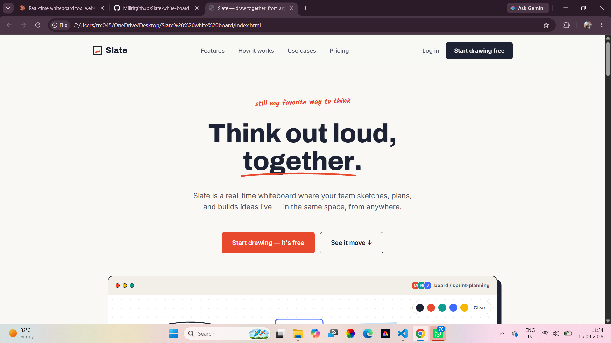
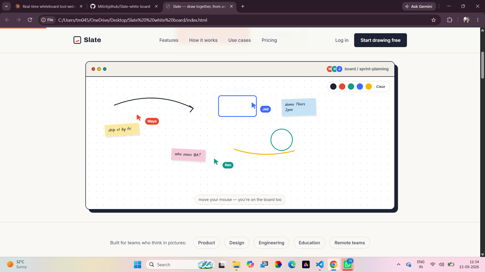
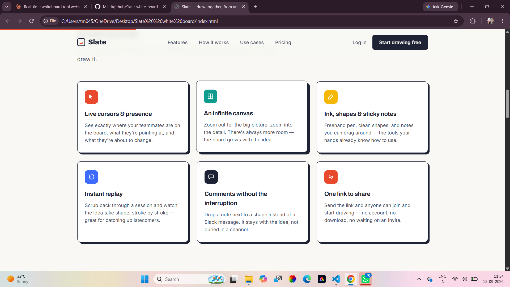

# Slate — Real-Time Whiteboard Landing Page

A single-file marketing site for **Slate**, a fictional real-time collaborative whiteboard tool. Built with plain HTML, CSS, and JavaScript — no framework, no build step, no dependencies.

  

## Preview

Open `index.html` in any modern browser — that's the whole app.

| Hero | Interactive board demo | Features |
|---|---|---|
|  |  |  |

## Features

- **Live-feeling hero mockup** — an SVG whiteboard scene with sticky notes and three animated collaborator cursors that drift around on a loop.
- **Actual freehand drawing** — pick a marker color from the toolbar and drag on the hero canvas to draw real strokes (mouse and touch). Includes a Clear button.
- **Scroll progress bar** — a thin indicator at the top of the page tracking scroll position.
- **Scroll-reveal animations** — cards and sections fade/slide into view via `IntersectionObserver`, with a `prefers-reduced-motion` fallback.
- **Responsive mobile navigation** — a hamburger menu that slides open a full nav panel below 800px.
- **FAQ accordion** — expandable question list, one item open at a time.
- **Pricing toggle** — switch the Team plan between monthly and yearly pricing.
- **Sections**: hero, roles band, features grid, how-it-works steps, use cases, testimonials, pricing, FAQ, final CTA, footer.

## Tech stack

- HTML5
- CSS3 (custom properties, CSS Grid/Flexbox, no preprocessor)
- Vanilla JavaScript (no frameworks or libraries)
- [Google Fonts](https://fonts.google.com/): Archivo, Inter, Kalam — loaded via CDN link in `<head>`

No build tools, package manager, or bundler are required.

## Project structure

```
.
├── index.html            # entire site: markup, styles, and scripts in one file
└── screenshots/          # preview images used in this README
    ├── hero.png
    ├── board-demo.png
    └── features.png
```

Everything (CSS in a `<style>` block, JS in a `<script>` block) lives inside `index.html` to keep the project trivially portable — copy the one file anywhere and it works.

## Getting started

Clone the repo and open the file directly:

```bash
git clone <your-repo-url>
cd <your-repo-folder>
open index.html      # macOS
# or just double-click index.html / drag it into a browser tab
```

No local server is strictly required, but if you run into any browser restrictions (e.g. with `<canvas>` or module loading in the future), serve it locally:

```bash
python3 -m http.server 8000
# then visit http://localhost:8000
```

## Customization notes

- **Colors** live in CSS custom properties at the top of the `<style>` block (`--paper`, `--ink`, `--coral`, `--teal`, `--yellow`, `--blue`) — change these to reskin the whole site.
- **Copy and pricing** are plain text/markup in the relevant `<section>` elements — search for `id="pricing"`, `id="faq"`, etc.
- **Cursor animation spots** for the hero demo are defined in the `cursors` array near the bottom of the `<script>` block if you want to adjust their movement.

## Browser support

Targets evergreen browsers (Chrome, Firefox, Safari, Edge). Uses `IntersectionObserver`, CSS custom properties, and Canvas 2D — all widely supported, with graceful fallbacks for reduced-motion preferences.

## License

This is a demo/portfolio project. Add a license of your choice (e.g. MIT) if you plan to publish it publicly.
